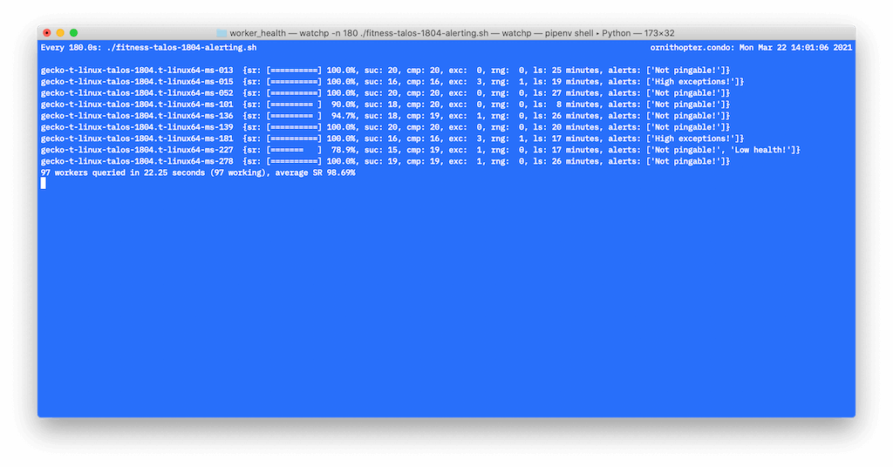

# worker health tools

## missing_workers

Helps us identify Bitbar workers that are configured in a TC queue that has pending jobs, but aren't reporting for work.

If a queue doesn't have work, we can't verify they're functioning (via the currently used method).

```
./missing_workers.sh -h
```

### fitness.py

Provide a report on a provisioner and worker-type.

Not specific to Bitbar (works on all taskcluster provisioners).



```
./fitness.py -h

# to report on all worker types under a provisioner
./fitness.py -p PROVISIONER
# for a specific worker-type in the provisioner
./fitness.py -p PROVISIONER WORKER-TYPE
```
